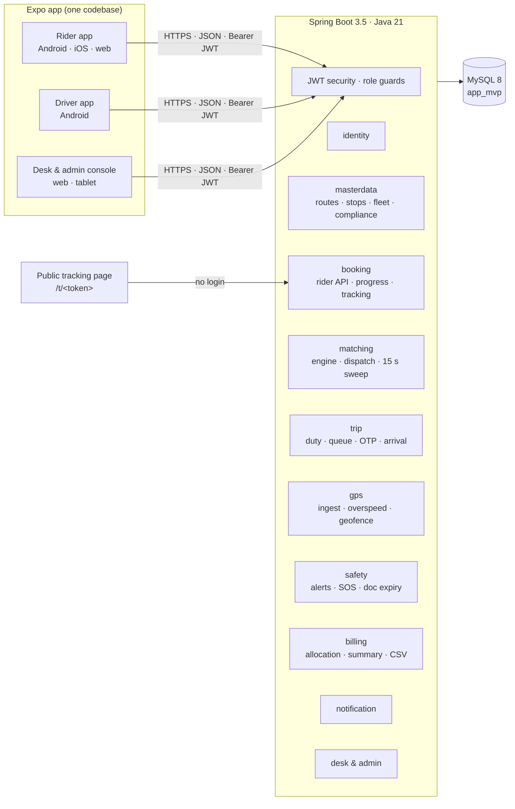
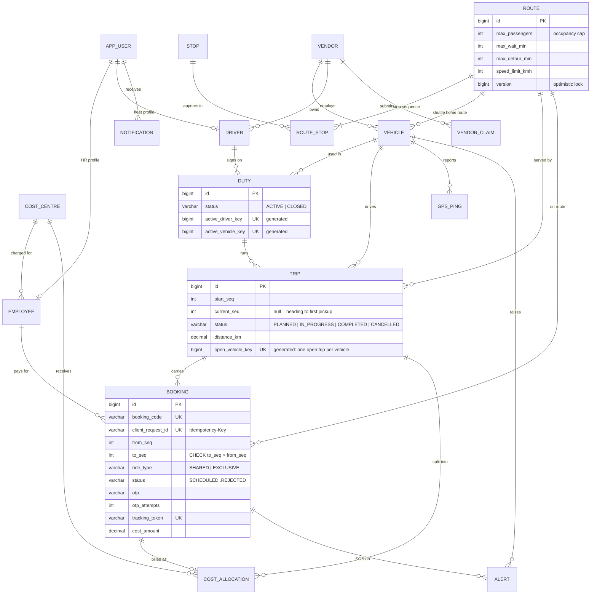

# Stage 1 · Plan & architecture

**Plant Ride MVP**: in-plant cab booking, pooling, fleet compliance and cost-centre billing, built from two SRM ECO TECH proposal decks for LHS:

| Deck | What it defines |
|---|---|
| *Plant Ride: Solution Proposal* (20 slides) | Problem, ride options, route sequencing, the 3-passenger occupancy rule, driver and employee apps, fleet records, optimisation engine, command centre, cost allocation, safety, architecture, rollout |
| *User Journey Walkthrough* (16 slides) | The rider, driver and desk journeys screen by screen, exception paths, and the single end-to-end trip on slide 16 |

The MVP delivers the deck's **Phase 2 pilot scope** (slide 19): one site, the three configured routes, scheduled/shuttle/exclusive rides, driver app with OTP boarding and live tracking links, and the command centre for the transport desk, plus the cost-centre billing that Phase 3 names, because it is the part finance asks about first.

---

## 1. The golden path

Deck 2, slide 16: *"One trip, three journeys, eight handovers."* Every step below is implemented and covered by `GoldenPathIntegrationTest`, `scripts/smoke-golden-path.mjs` and the headless UI walk.

| # | Lane | What happens | System behaviour | API |
|---|---|---|---|---|
| 0 | Driver | S. Kumar signs on with C-12 | Five-point vehicle check and odometer; licence, gate pass, insurance, fitness and PUC checked. **Riders already waiting at Gate 2 are pooled onto C-12 immediately** (after-commit dispatch). | `POST /api/driver/duty/start` |
| 1 | Rider | A. Raghavan books Gate 2 → Blast Furnace | Route resolved from the stop sequence; engine offers *Shared cab C-12, 2 of 3 seats taken*; booking is idempotent | `POST /api/rider/ride-options`, `POST /api/rider/bookings` |
| 2 | Desk | Booking appears on the live board | C-12 shows *To pickup, Route 1*; the queue loses the request | `GET /api/desk/board` |
| 3 | Driver | Pickup lands in the trip queue | Stops in route order: Gate 2 *pick up 3*, Coke Plant *drop 1*, Blast Furnace *drop 2* | `GET /api/driver/queue` |
| 4 | Rider | Gets vehicle no., driver contact, tracking link | MH 12 AB 4412, S. Kumar +91…, 4-digit OTP, `/t/<token>` public page (no personal data) | `GET /api/rider/bookings/{id}`, `GET /api/public/track/{token}` |
| 5 | Driver | Arrives, confirms OTP, trip starts | Wrong codes counted and capped at 5; cannot leave a stop with a rider still waiting | `POST /api/driver/trips/{id}/arrive`, `…/board` |
| 6 | Rider | Tracking switches to in-trip | Stage `ON_TRIP`, drop ETA, co-riders | polling `GET /api/rider/bookings/{id}` |
| 7 | Driver | Arrival at the drop closes the trip | Arrival (tapped, or a GPS ping inside the stop's geofence) completes the drop; the last drop closes the trip | `POST …/arrive`, `POST /api/driver/location` |
| 8 | Desk | 3.4 km charged to CC-4471 | Trip cost = GPS route km × rate card; split by the distance rule; one allocation per ride, shares add up to the paisa | `GET /api/billing/summary`, `GET /api/billing/export` |

---

## 2. MVP scope against the decks

| Deck capability | MVP | Notes |
|---|---|---|
| Book in under 30 s; HRMS-prefilled, editable details; book for a guest (host pays) | ✅ | Employee record stands in for HRMS |
| Ride options: shuttle (information only), shared, exclusive (approval or grade rule) | ✅ | Shared-on-demand pooling (deck Phase 2) is included: riders join cabs already on the route |
| Scheduled rides up to 7 days ahead | ✅ | Dispatched 20 min before pickup (setting) |
| Location sequencing: 3 routes, stops in order, leg times, geofences as master data | ✅ | Admin can resequence and edit rules without a release |
| Occupancy rule: max 3 per pick-up run, configurable per route | ✅ | Enforced per route **segment**, as a hard filter, under a row lock |
| Matching engine: filter → score → suggest, with an audit of every decision | ✅ | Reason stored on every booking; desk sees why each cab was or was not eligible |
| Confirmation with vehicle no., driver contact, OTP, shareable tracking link | ✅ | Link expires when the ride closes |
| Driver app: sign-on check, sequenced queue, OTP boarding, no-show after wait, issues, SOS | ✅ | Big targets; GPS pings sent while on duty |
| Geofence auto-close at the drop | ✅ | Server-side on GPS ping; manual "Arrived" works everywhere |
| Fleet records: insurance/fitness/PUC, licence/gate pass, expiry alerts at 30/7/1 days, **block on expiry** | ✅ | Alerts deduplicated per band |
| Command centre: fleet on one screen, KPIs, alerts, overrides | ✅ | Web console (Expo web) on the desk monitor, tablet layout at the gate |
| Cost allocation: equal or by-distance split, cost centre, budgets, ERP export | ✅ | CSV export shaped for the SAP import |
| Vendor bill vs GPS reconciliation | ✅ | GPS km is the contractual source (deck note) |
| Exception paths: no-show, full cab, breakdown re-match, GPS gap, SOS | ✅ | Breakdown puts riders back in the queue from the last stop reached |
| Notifications with delivery log | ✅ in-app | Push/SMS/WhatsApp gateways plug in behind `NotificationService` |
| Audit trail | ✅ | Every state change: who, what, when |
| Hindi UI, offline buffering in the driver app, SSO/HRMS/SAP integrations, maps, demand forecasting, route solver | ⏭ | Later phases in the deck; see `docs/03-self-test-and-review.md` §4 |

---

## 3. Architecture

A **modular monolith**, as the deck recommends on slide 18 ("one application, clear modules; microservices only when many plants force it").

**Dispatch has two triggers.** A sweep every 15 s (deck slide 14: *"rules plus a score, refreshed every 15 seconds"*), and an event published by anything that frees capacity or adds demand: a driver signing on, a trip closing, an approval, a rule change or a breakdown. Waiting riders are matched the moment the triggering transaction commits.

**Concurrency model.** Matching locks the route row (`SELECT … FOR UPDATE`) before reading seat loads and before inserting the booking. The chosen vehicle is locked before a new trip opens. Connections run at `READ COMMITTED`, so reads made after the lock see what the previous holder committed. See `docs/03-self-test-and-review.md` for the two race bugs this design came out of.

### Module map

| Package | Owns |
|---|---|
| `common` | config, JWT security, error envelope, audit log, settings, utilities |
| `identity` | users, employees, login |
| `masterdata` | stops, routes (`RoutePlan` = sequence arithmetic), vehicles, drivers, vendors, cost centres, document compliance |
| `matching` | `MatchingEngine` (pure evaluation), `DispatchService` (locking + assignment), `EtaCalculator`, `SeatLoad`, scheduler |
| `trip` | duties, trips, driver queue, arrive/board/no-show state machine, issues & SOS |
| `booking` | rider API, ride options, booking lifecycle, progress, public tracking |
| `gps` | ping ingest, overspeed, geofence arrival |
| `safety` | alerts, document-expiry monitor |
| `billing` | cost allocation, monthly summary, vendor reconciliation, CSV export |
| `notification` | in-app notifications |
| `desk` | live board KPIs, queue actions, admin routes/rules/compliance/audit, demo reset |

---

## 4. Domain rules as implemented

| Rule (deck) | Implementation |
|---|---|
| **Max 3 passengers per vehicle on pick-up runs**; configurable per route and vehicle type | `route.max_passengers`; effective cap = min(route cap, vehicle seats). Load is computed per route segment (`SeatLoad`): a rider occupies pickup up to (not including) drop, so "drop 1, pick up 1" at Coke Plant is allowed. Exclusive rides use the vehicle's own seats. |
| Group larger than the cap → split or exclusive | `GROUP_TOO_LARGE` on shared; exclusive allowed |
| Filter: seats, vehicle type, zone pass, duty hours, cap | Engine hard filters: shuttle, off-road, expired vehicle/driver documents, busy on another route or exclusive ride, already past the pickup, cap, detour limit, duty hours |
| Score: pickup ETA, detour for riders on board, empty km, seats filled, own vs vendor | `score = 1.0·eta + 0.5·detour + 2.0·emptyKm − 1.5·seatsTaken + 1.0·vendor` (weights in `application.yml`) |
| OTP boarding: right rider, right cab | 4-digit OTP per booking, constant-time compare, 5 attempts then locked (counter commits even though the request fails) |
| No-show after 5 min wait; 3 in 30 days pauses booking | `route.max_wait_min`; `NO_SHOW_PAUSE_COUNT` / `NO_SHOW_WINDOW_DAYS` settings |
| Geofence at the drop ends the trip | GPS ping within `stop.geofence_m` of the next stop records the arrival |
| Expired licence/fitness/insurance blocks dispatch, not a warning | Blocks sign-on and matching; alerts at 30/7/1 days and on expiry |
| Cost: equal or by distance; visitor charged to host; GPS km is the billing source | `COST_SHARING_RULE`; guest bookings carry the host's cost centre; trip km from the route's configured leg km |
| Budget alerts at 80% and 100% | Billing view flags WARN ≥ 80 %, OVER ≥ 100 % |
| Track vehicles, not people | Public tracking DTO contains no names or phones; link returns 410 once closed |

---

## 5. Data model

Schema: [`backend/src/main/resources/schema.sql`](../backend/src/main/resources/schema.sql). Seed: [`data.sql`](../backend/src/main/resources/data.sql).

19 tables. **Invariants enforced by MySQL itself**, as the last line of defence behind the services:

| Invariant | Constraint |
|---|---|
| One active duty per driver, and per vehicle | `uk_duty_active_driver`, `uk_duty_active_vehicle` on generated columns (MySQL has no partial indexes) |
| One open trip per vehicle | `uk_trip_open_vehicle` on a generated column |
| A ride is billed once | `uk_alloc_booking` |
| A retried request never books twice | `uk_booking_client_req` |
| Drop comes after pickup | `ck_booking_seq` |
| Cap, wait, detour and speed within sane ranges | `ck_route_*` |

Each of these maps to a readable message in `GlobalExceptionHandler`, in case two users race past the service-level checks.

### Seed data: the demo cast

Password for every account: **`Plant@123`**. Dates are relative to `NOW()`, so the state is identical on any day.

| Login | Who | Role |
|---|---|---|
| `LHS-40218` | A. Raghavan, Operations, CC-4471 | Rider (golden path) |
| `DRV-2281` | S. Kumar, cab C-12, own fleet, **off duty** | Driver (golden path) |
| `admin` | R. Kapoor | Fleet admin + desk |
| `desk` | J. Thomas | Transport desk only |
| `LHS-52287` | H. Patel, 3 no-shows in 30 days | Rider whose booking is paused |
| `DRV-2310` | K. Joshi, gate pass expired | Driver blocked from duty |
| `DRV-1466` | M. Ali, drives C-09 (insurance expired) | Driver whose cab is blocked |

State at start: **M. Iyer and S. Banerjee are waiting at Gate 2** (boarding OTPs 9317 and 5540), and no cab is eligible for them until S. Kumar signs on:

| Cab | Why it cannot take them |
|---|---|
| C-21 | Driver A. Singh is 8 h 52 m into a 9 h duty |
| C-07, C-33 | Busy on Routes 2 and 3 (C-07 has an overspeed alert; C-33's insurance lapses in 6 days) |
| C-44 | Off-road (breakdown) |
| C-09 | Insurance expired: blocked |
| C-15 | Its driver's gate pass has expired |
| S-03 | Shuttle: runs to timetable, never dispatched |

Plus 30 days of generated history (480 trips, ~960 rides), vendor claims with Vendor B billing 6.5 % over GPS, budgets calibrated so one cost centre is over budget, and open alerts for the live board.

---

## 6. Technology choices

| Choice | Why |
|---|---|
| Spring Boot 3.5.16, Java 21, Spring Data JPA, Spring Security (JWT, stateless), springdoc 2.8 | As specified. 3.5 is the latest 3.x line. |
| MySQL 8, `schema.sql` owns the DDL, Hibernate `ddl-auto: validate` | As specified. Validation proves at every start that entities match the schema. The deck's PostgreSQL/PostGIS + ClickHouse + Redis is the scale-out target; the MVP stays on one MySQL. |
| Expo SDK 57, React Native 0.86, TypeScript strict, Expo Router, NativeWind 4.2, TanStack Query, Axios | One codebase serves the rider and driver apps (phones) and the desk console (web). Query handles loading, error, polling and cache invalidation. |
| Desk console as Expo web, not a separate SPA | One API client, one set of types, one design system: less to keep in sync for an MVP. |
| READ COMMITTED + pessimistic route lock | Correct last-seat behaviour under concurrency, proven by a race test. |

The REST contract is in [`02-api-contract.md`](02-api-contract.md) and, generated from the code, in [`openapi.json`](openapi.json) (Swagger UI at `/swagger-ui.html`).
